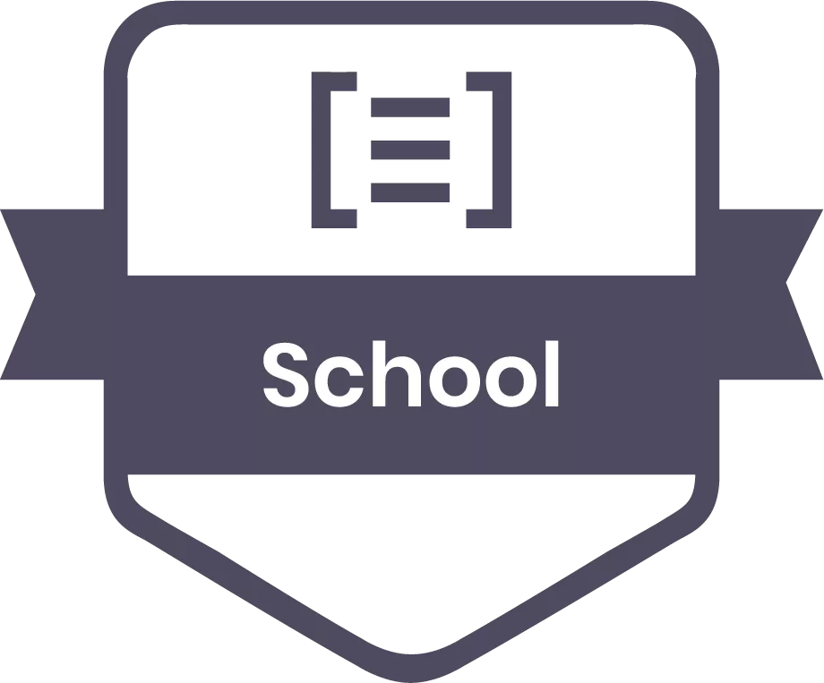

# SFEIR School Next.js

<p align="center">
 
</p>

<br/>

[Discover the SFEIR Schools](https://www.sfeir.com/fr/le-contenus-dexperts-de-la-technologie-et-de-linnovation/formation-gratuite-avec-nos-experts/)

# Slides

You can view the slides [here](https://sfeir-open-source.github.io/sfeir-school-nextjs/).

## Cloning without slides

To clone this repository without the slides (which can be heavy) :

```bash
git clone --single-branch --branch without-slides https://github.com/sfeir-open-source/sfeir-school-nextjs.git
```

## Serving slides locally

```bash
npm run serve -w doc
```

Of if you don't have node, you can use docker `docker-compose up`, and open slides on http://localhost:4242/.

## Workshop

Workshops are in directory `steps` :

- two directories per workshop :
  - one with a README.md with workshop steps and source file to complete
  - a second directory suffixed with `-solution` which contains source file with solutions.

To run a workshop application :

```bash
npm run dev -w <workshop-number>
```

To run a workshop solution :

```bash
npm run dev -w <workshop-number>-solution
```

## Contributing

### Contributing Guidelines

Read through our [contributing guidelines][contributing] to learn about our submission process, coding rules and more.

### Want to Help?

Want to file a bug, contribute some code, or improve documentation? Excellent! Read up on our guidelines for [contributing][contributing] and then check out one of our issues labeled as <kbd>help wanted</kbd> or <kbd>good first issue</kbd>.

### Code of Conduct

Help us keep Angular open and inclusive. Please read and follow our [Code of Conduct][codeofconduct].

[contributing]: CONTRIBUTING.md
[codeofconduct]: https://github.com/sfeir-open-source/code-of-conduct/blob/master/CODE_OF_CONDUCT.md
