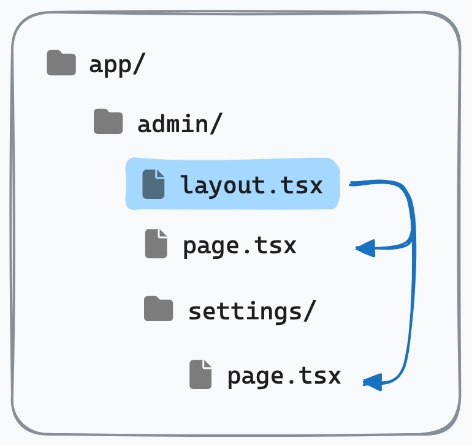

# SFEIR School Next.js Docs – Architecture & Workflow

Source of truth for subagents and developers working with the docs/ folder.

## Overview

The `docs/` folder is a standalone **reveal.js-based training slide deck** that teaches Next.js from beginner to expert. It uses:

- **[SFEIR School Theme](https://github.com/sfeir-open-source/sfeir-school-theme)** (reveal.js framework) — provides the presentation engine, slide styling, and speaker-notes support
- **Live-Server** — hot-reload development server (port 4242)
- **SASS** — slide styling
- **Markdown** — slide content, organized into numbered modules

The deck is **generated dynamically** via JavaScript (`docs/scripts/slides.js`), which pulls markdown files from `docs/markdown/` and registers them in order. Markdown files exist on disk but **do not automatically appear in the deck** — they must be explicitly added to `docs/scripts/slides.js`.

## Directory Structure

```
docs/
├── index.html                    # Entry point (reveal.js container + script loader)
├── scripts/
│   ├── slides.js                 # ✅ Master slide registry — defines deck order
│   └── dont-touch/
│       └── prepare-script.js      # Copies sfeir-school-theme to web_modules/
├── markdown/                      # ✅ Slide content (organized by module)
│   ├── 00-school/                # Setup/logistics slides
│   ├── 01-intro/                 # What is Next.js
│   ├── 02-routing/               # App Router fundamentals
│   ├── 03-server-components/     # CSR/SSR/RSC concepts
│   ├── 04-data-fetching/         # Data fetching & caching
│   ├── 05-mutations/             # Server Actions & forms
│   ├── 06-error-management/      # Error boundaries & handling
│   ├── 07-middleware/            # Middleware & routing config
│   ├── 08-rendering-methods/     # Static/dynamic/streaming rendering
│   ├── 09-deploying-and-hosting/ # Deployment strategies
│   └── 20-conclusion/            # Wrap-up
├── assets/
│   ├── images/                   # ✅ Diagrams and screenshots (organized by module)
│   │   ├── 02-routing/
│   │   ├── 03-server-components/
│   │   └── ...
│   └── (other media)
├── scss/
│   └── slides.scss               # Custom slide styling
├── css/
│   └── slides.css                # Compiled SASS output
├── package.json                  # Nx project config & local targets
└── tsconfig.json                 # TypeScript config
```

## Slide File Naming & Organization

### File Naming Convention

Each slide is a single markdown file following the pattern:

```
<prefix>-<slug>.md
```

- **`<prefix>`**: Sortable number (00, 10, 20, 30…, with decimals for sub-slides: 10.1, 10.2…)
- **`<slug>`**: Kebab-case descriptor (e.g. `naming-page`, `layout-schema`, `use-client`)

**Examples:**

- `01-intro.md` — basic intro slide
- `10-naming.md` — parent concept slide
- `10.1-naming-page.md` — sub-concept (child of 10-naming)
- `10.2-naming-layout.md` — another sub-concept
- `40-layout.md` — next top-level concept

**Ordering:** Use the prefix to sort slides within a module. Gaps in numbering (10, 20, 30) help future expansion without renumbering.

### Registration in slides.js

**Files do NOT automatically appear in the deck.** Every module has an explicit function in `docs/scripts/slides.js` that returns an ordered array of file paths:

```javascript
function routingSlides() {
  return [
    '02-routing/00-title.md',
    '02-routing/01-intro.md',
    '02-routing/02-vocabulary.md',
    '02-routing/10-naming.md',
    '02-routing/10.1-naming-page.md',
    '02-routing/10.2-naming-layout.md',
    // ... more slides
  ];
}
```

The main `formation()` function concatenates all modules:

```javascript
function formation() {
  return [
    ...schoolSlides(),
    ...introSlides(),
    ...routingSlides(),
    // ... all modules in order
  ].map(slidePath => ({ path: slidePath }));
}
```

**Critical:** If you add, rename, delete, or reorder a file, **you MUST update this array**, or the slide will not appear (or will appear in the wrong position).

## Slide Structure & Markup

For the full slide markup reference — basic slides, code slides, multi-column layouts (`##++##`), multi-slide files (`##==##`), fragments, lab slides, title/speaker slides, and the full class list — use the **`manage-slides`** skill (`.agents/skills/manage-slides/SKILL.md`). Read it before writing or editing any slide markdown.

Quick facts worth remembering at this level:

- Speaker notes always go in a trailing `Notes:` section, **written in French**, even though slide bodies are in English. Keep them short and delivery-focused.
- Only use CSS classes that already appear in the codebase — don't invent new ones.

## Technologies & Dependencies

### Core Framework

- **reveal.js** (via SFEIR School Theme) — presentation engine
- **Live-Server** — dev server with hot reload
- **SASS** — CSS preprocessing

### Build & Serving

- **Nx** — monorepo orchestration (all commands run at workspace root)
- **SWC** — TypeScript/JavaScript transpilation (if needed)
- **esbuild** — bundling (if needed)

### Asset Handling

- **Bright** — code syntax highlighting (included via SFEIR theme)
- Images — stored in `docs/assets/images/<module>/`, referenced as relative paths

## Commands (Run at Workspace Root)

All commands use `npm run` with the `-w docs` workspace flag (Nx syntax) or equivalently `npx nx <target> --project=docs`.

### Development

```bash
# Start live server + watch SASS (recommended for content editing)
npx nx start -- docs

# Or split into separate terminals:
npx nx dev docs          # Live server only
npx nx sass docs         # SASS compiler only
```

Opens deck at **http://localhost:4242** with hot reload on markdown and SASS changes.

### Production Preparation

```bash
# Build/prepare (copies sfeir-school-theme dependencies)
npx nx prepare docs
```

### Viewing the Deck

```bash
# Serve at http://localhost:4242
npm run launch:slides
```

(This is a workspace-level script that wraps `npx nx start docs`.)

## Pedagogical Structure

Modules are ordered to form a beginner → expert progression:

| Module                   | Topic                                        | Audience           |
| ------------------------ | -------------------------------------------- | ------------------ |
| 00-school                | Setup, logistics, intro                      | Everyone           |
| 01-intro                 | What is Next.js, history, why                | Beginner           |
| 02-routing               | App Router, pages, layouts, navigation       | Beginner           |
| 03-server-components     | CSR, SSR, RSC concepts, composition rules    | Early Intermediate |
| 04-data-fetching         | Server fetch, caching layers, memoization    | Intermediate       |
| 05-mutations             | Server Actions, forms, state management      | Intermediate       |
| 06-error-management      | Error boundaries, expected/unexpected errors | Intermediate       |
| 07-middleware            | next.config, middleware API, rewrites        | Advanced           |
| 08-rendering-methods     | Static, dynamic, streaming, Suspense         | Advanced           |
| 09-deploying-and-hosting | Vercel, Docker, static export                | Advanced           |
| 20-conclusion            | Wrap-up, next steps                          | Everyone           |

**Implications for content:**

- Module N should not assume familiarity with concepts from Module N+2.
- 02-routing should be example-first, light on jargon.
- 08-09 can assume full mastery of RSC, caching, and data fetching.

## Assets & Images

### Image Placement

Store images in `docs/assets/images/<module>/` and reference them with relative paths:

```markdown

```

### Common Image Locations

- `02-routing/naming-page.png`, `layout-schema.png` — routing concepts
- `03-server-components/react-solution.jpeg` — RSC explanation
- etc.

If a slide needs a diagram and you can't generate it, describe what's needed and ask the user for the asset file rather than inventing an `` path that doesn't exist.

## Best Practices for Writers/Agents

1. **Read sibling files before writing.** Read 3–5 existing slides in the same module to match style, depth, and formatting. Don't guess conventions — confirm them.

2. **Ground technical claims in official docs.** Verify every non-obvious claim against [nextjs.org/docs](https://nextjs.org/docs). Check that behavior matches the pinned Next.js version (16.1.6, see root `package.json`).

3. **Update slides.js when you add/rename/delete/reorder files.** This is the single easiest step to skip and the hardest to debug later.

4. **Follow the `manage-slides` skill for markup syntax.** It covers columns, multi-slide files, and fragments — don't guess the separators from memory.

5. **Write English speaker notes.** They guide the live presenter — keep them short and delivery-focused, not slide-text repetition. Write them in English.

6. **Lab slides reference workshop apps.** Check `/apps` directly for real folder names (e.g. `02-navigation`, not `02-routing`). Include the correct `npm run dev -- <app>` command.

7. **Make minimal diffs.** Don't reformat or restyle slides you weren't asked to touch.

8. **Confirm scope on major changes.** If a request implies restructuring multiple modules or mass renumbering, confirm with the user first.

## Typical Workflow

**Adding a new slide:**

1. Identify the target module and read 3–5 sibling files to match style.
2. Pick an available number slot (e.g., 25, 26, 27…) or decimal (10.1, 10.2…).
3. Write the markdown file with proper directive, content, and English speaker notes.
4. Add the file path to the correct module function in `docs/scripts/slides.js` in the right order.
5. Check that any referenced images exist in `docs/assets/images/<module>/`.
6. Verify the deck loads and the slide appears at http://localhost:4242.

**Fixing a technical error:**

1. Read the current slide and verify the error against nextjs.org/docs.
2. Edit the slide file in place, preserving formatting and structure.
3. Do NOT edit `slides.js` (file path/order unchanged).
4. Verify the deck reloads and the fix is visible.

**Reordering slides:**

1. Decide the new order and confirm with the user if it's a major restructure.
2. Update the array in `docs/scripts/slides.js` without changing file paths.
3. Optionally rename files to match new order (e.g. 10, 20, 30 → 05, 15, 25), but update slides.js to match.
4. Verify the deck loads and slides appear in the new order.

## Troubleshooting

| Problem                         | Cause                                           | Fix                                                           |
| ------------------------------- | ----------------------------------------------- | ------------------------------------------------------------- |
| Slide doesn't appear in deck    | File not registered in `docs/scripts/slides.js` | Add the path to the correct module function                   |
| Slide appears in wrong position | `slides.js` array out of order                  | Reorder the array entry                                       |
| Images broken                   | Path mismatch (e.g., relative vs absolute)      | Use `./assets/images/<module>/<image>` and verify file exists |
| Live reload not working         | SASS or markdown not being watched              | Restart `npm run start -- docs`                               |
| Theme looks broken              | sfeir-school-theme not copied to web_modules    | Run `npm run prepare -- docs`                                 |

## Related Resources

- **`manage-slides` skill** (`.agents/skills/manage-slides/SKILL.md`): Full slide markup syntax reference — read before writing/editing slide markdown
- **Next.js Official Docs**: https://nextjs.org/docs
- **SFEIR School Theme**: https://github.com/sfeir-open-source/sfeir-school-theme
- **Reveal.js**: https://revealjs.com/
- **Workspace Root** (`AGENTS.md`): See root `AGENTS.md` for overall project structure and commands
